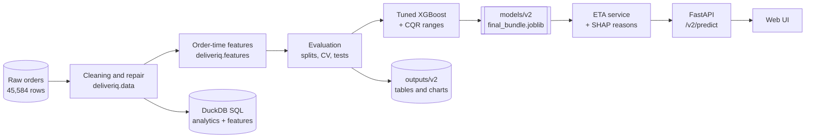
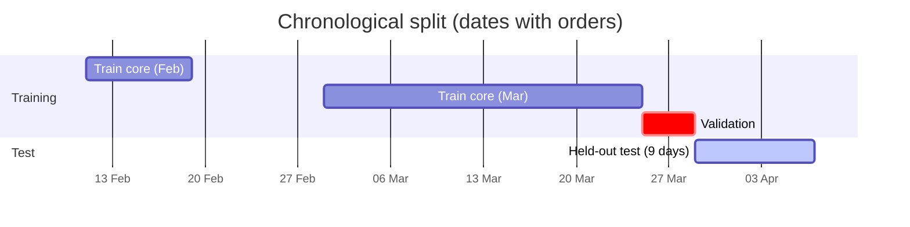
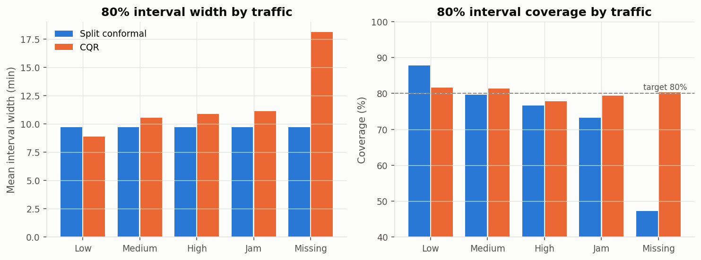
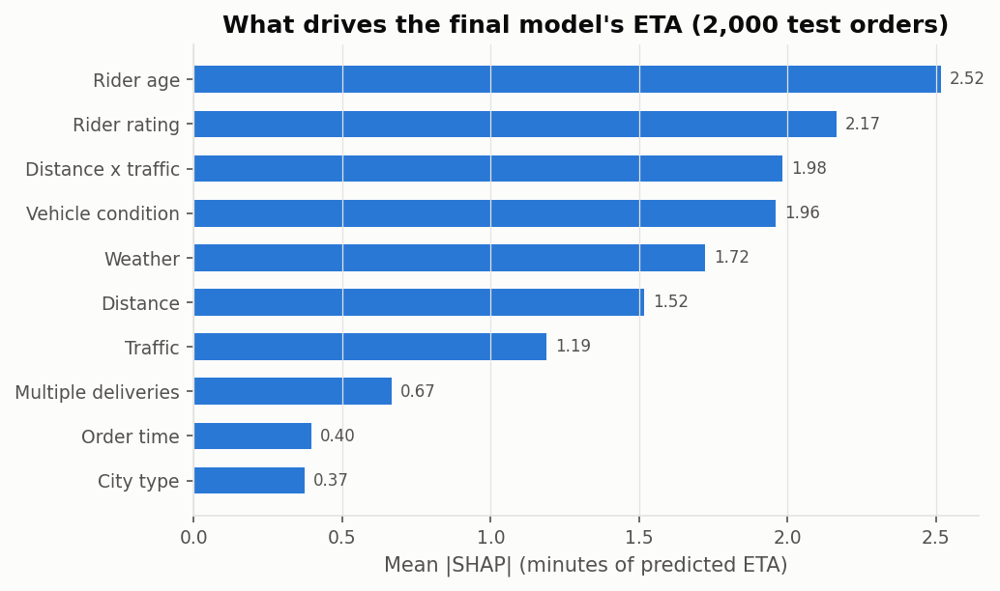
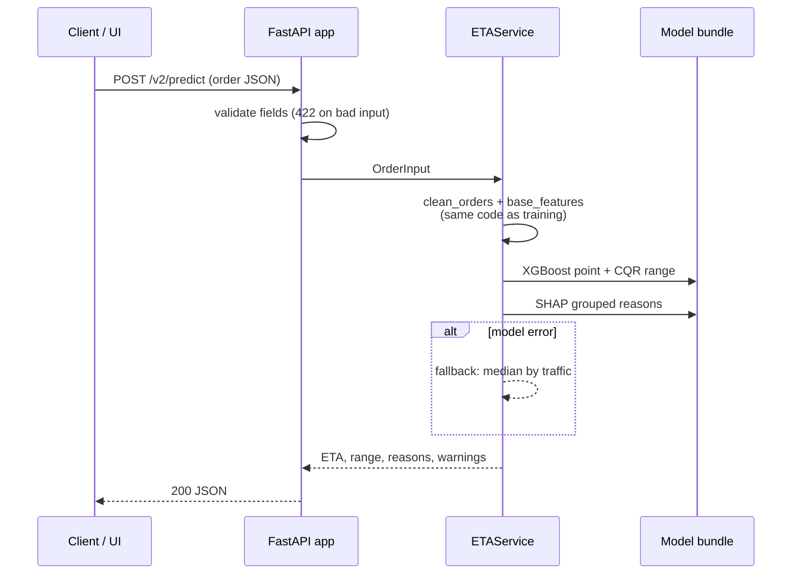
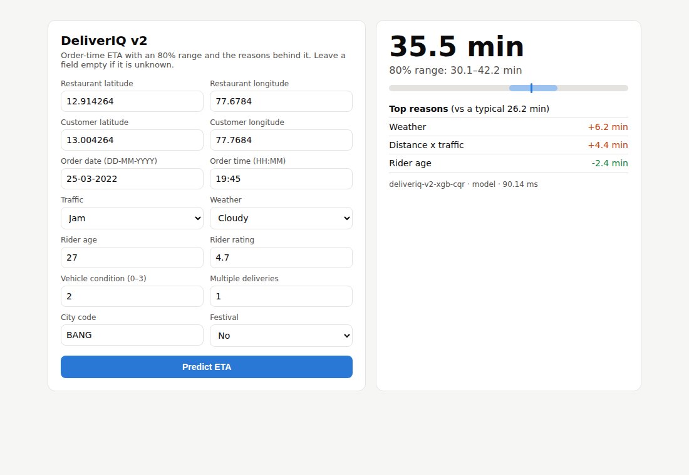

<div align="center">

# DeliverIQ

### Leakage-Aware Food Delivery ETA Prediction & Serving System

Predicts how long a food order will take **at the moment it is placed**, returns a calibrated
80% range and the top reasons behind the estimate, and serves it through a FastAPI REST API.


[](https://github.com/akphp7/DeliverIQ-Leakage-Aware-Food-Delivery-ETA-Prediction-Serving-System/actions/workflows/tests.yml)

</div>

---

## Highlights

| | Result (held-out final 9 days, 9,446 orders) |
|---|---|
| **Accuracy** | Tuned XGBoost: **3.13 min MAE**, 3.89 min RMSE, R² 0.832 (Linear Regression: 4.76 min MAE) |
| **Calibrated ranges** | 80% ETA range covers **80.5%** of orders; width adapts from 8.9 min (low traffic) to 18.1 min (traffic unknown) |
| **Leakage control** | No same-order pickup time; out-of-fold restaurant-history encoding; SQL features use previous days only; guarded by tests |
| **Evaluation** | Chronological split, 5-fold CV, rolling-origin time CV, paired and day-block bootstrap tests, feature ablation |
| **Explainability** | SHAP global importance and per-order top-3 reasons |
| **Serving** | FastAPI REST API, ~65 ms per prediction including reasons, rule-based fallback, 33 pytest tests |
| **Benchmark** | Under the protocol of a 2025 study on the same dataset: R² **0.844** vs 0.76 published ([details](docs/BENCHMARK.md)) |

## Contents

- [Problem and scope](#problem-and-scope)
- [Dataset](#dataset)
- [System overview](#system-overview)
- [Pipeline phases](#pipeline-phases)
- [Key design decisions](#key-design-decisions)
- [Evaluation protocol](#evaluation-protocol)
- [Results](#results)
- [Comparison with published work](#comparison-with-published-work)
- [Serving API](#serving-api)
- [Quick start](#quick-start)
- [Repository structure](#repository-structure)
- [Limitations](#limitations)
- [Documentation](#documentation)
- [References and acknowledgements](#references-and-acknowledgements)

---

## Problem and scope

**Question:** given what is known when a customer places an order (restaurant and customer
location, time, traffic and weather labels, rider and vehicle attributes), how many minutes
will delivery take, how sure are we, and why?

| In scope | Out of scope (and why) |
|---|---|
| Order-time ETA regression | Demand forecasting: ~1,000 orders/day over 22 cities is too sparse |
| Data repair and leakage control | Live traffic / weather feeds: the dataset has static labels only |
| Chronological evaluation and significance testing | Cloud deployment: the API runs locally; production design is documented, not built |
| Prediction intervals and SHAP explanations | Later-stage ETAs (rider assigned, picked up): design only |
| SQL analytics and SQL-built features | |
| FastAPI serving, tests, drift and A/B sizing | |

## Dataset

A copy of the public Kaggle *Food Delivery Dataset* (G. Malik), the same data used by the
study in [Comparison with published work](#comparison-with-published-work). Included at
[`data/raw/food_delivery.csv`](data/raw/food_delivery.csv).

| Property | Value |
|---|---|
| Orders | 45,584 |
| Columns | 20 (locations, order/pickup time, rider age/rating, vehicle, traffic, weather, festival, city type, delivery time) |
| Period | 11 Feb – 6 Apr 2022 (44 days) |
| Cities / restaurants / riders | 22 / 440 / 1,320 (parsed from rider IDs) |
| Target | `Time_taken (min)`, 10–54 min, mean 26.3 |

**The data is semi-synthetic.** Checks in [Phase 0](docs/METHODOLOGY.md#phase-0--data-repair) and
[Phase 3](docs/METHODOLOGY.md#phase-3--statistics) found:

- Pickup delay is always exactly 5, 10 or 15 min and has no effect on delivery time.
- Rider age acts as a step (+6.3 min at exactly 30, flat on either side); rating acts in three bands.
- Traffic is determined by the clock hour (Low 08–10 & 22–00, High 11–14, Medium 15–19, Jam 19–22).
- Drop points are the restaurant location plus one of 12 fixed offsets.
- February contains 10 smaller cities; March–April contains 12 larger cities.

Scores are therefore not comparable with real-world ETA systems.

## System overview



Detailed diagrams (module map, cleaning flow, out-of-fold encoding, CV folds, CQR, SQL lineage,
fallback) are in [docs/ARCHITECTURE.md](docs/ARCHITECTURE.md).

## Pipeline phases

Every phase is one script; each writes its tables and charts to `outputs/v2/phaseN/`.

| Phase | Script | What it does | Runtime |
|---|---|---|---|
| 0 | `pipelines/p0_data_fixes.py` | Parse clock formats, repair coordinates, flag invalid values, baseline models | ~45 s |
| 1 | `pipelines/p1_evaluation.py` | Random vs chronological split, 5-fold and time CV, paired tests, ablation | ~13 min |
| 2 | `pipelines/p2_models.py` | XGBoost tuning, RF+XGB blends, prediction intervals, late/early trade-off, SHAP; saves the model | ~3 min |
| 3 | `pipelines/p3_statistics.py` | Hypothesis tests with effect sizes, confounding check, OLS diagnostics | ~10 s |
| 4 | `pipelines/p4_sql_features.py` | Analytical SQL and leak-free SQL history features, with a pandas cross-check | ~1 min |
| 5 | `pipelines/p5_production.py` | Fallback table, service smoke test, latency, A/B sample sizes, PSI drift | ~30 s |
| 6 | `pipelines/p6_paper_benchmark.py` | Benchmark under the protocol of arXiv:2503.15177 | ~1 min |

`python -m pipelines.run_all` runs all phases; a fresh run reproduces every saved table.

## Key design decisions

| Decision | Why |
|---|---|
| Recover 5,799 unparsed order times (day-fraction and `24:05` formats, blanks) | A naive `HH:MM` parser silently loses 12.7% of hours |
| Repair 3,640 restaurants logged at (0, 0) with the city centre + recorded offset; flag them | Keeps real distances instead of one fake restaurant |
| Never use the order's own pickup time | It is only known after the ETA is shown (target leakage) |
| Out-of-fold, smoothed restaurant history; later **dropped** | Removing it improved CV MAE in all 5 folds (3.199 → 3.109): prep time is noise here |
| Keep missing values as a category plus a flag | Unknown traffic is informative and widens the range |
| Remove the hand-written weather factor | Data contradicts it: Sunny is fastest, Cloudy/Fog slowest |
| Serve tuned XGBoost, not the RF+XGB blend | Blend is better by only 0.008 min; not worth the latency and complexity |
| Serve CQR ranges, not a fixed ± margin | Fixed width covered only 47% of unknown-traffic orders |

Full reasoning and numbers: [docs/METHODOLOGY.md](docs/METHODOLOGY.md).

## Evaluation protocol

Nothing is chosen on the test days. Tuning, blend weights and interval calibration use a
validation block that sits before them.



| Block | Orders | Used for |
|---|---|---|
| Train core (11 Feb – 24 Mar) | 31,895 | Fitting during tuning and calibration |
| Validation (25 – 28 Mar) | 4,243 | Hyperparameters, blend weights, interval calibration |
| Test (29 Mar – 6 Apr) | 9,446 | Final scores, touched once |

Also reported: random 80/20 split (for comparison with earlier work), 5-fold CV, rolling-origin
time CV (4 folds × 4 days), paired bootstrap on orders and on whole days, Wilcoxon tests.

## Results

### Final model comparison (test days)

| Model | MAE (min) | RMSE | R² | P90 error | Within ±5 min | Late > 5 min |
|---|---|---|---|---|---|---|
| Linear Regression | 4.76 | 5.98 | 0.603 | 9.67 | 59.9% | 19.5% |
| Random Forest | 3.19 | 3.97 | 0.825 | 6.36 | 80.3% | 9.9% |
| XGBoost (baseline settings) | 3.15 | 3.93 | 0.828 | 6.27 | 80.7% | 10.1% |
| **XGBoost (tuned, served)** | **3.13** | **3.89** | **0.832** | **6.22** | **81.3%** | **9.8%** |
| RF + XGB weighted blend | 3.12 | 3.88 | 0.833 | 6.17 | 81.5% | 9.6% |

Tuned XGBoost beats Random Forest by 0.058 min (95% CI −0.081 to −0.037, paired bootstrap).

### Prediction intervals (80% target)

| Method | Coverage | Mean width | Coverage when traffic unknown |
|---|---|---|---|
| Split conformal (fixed ± 4.9 min) | 79.7% | 9.7 min | 47.2% |
| **CQR (served)** | **80.5%** | 10.3 min | **80.3%** |



### What drives the ETA (SHAP)



Rider age and rating rank first because the dataset encodes them as step rules (see
[Dataset](#dataset)); this explains the model, not real rider behaviour.

### Where the model struggles (segment MAE, random split)

| Traffic | MAE | | Distance | MAE | | Time | MAE |
|---|---|---|---|---|---|---|---|
| Low | 2.72 | | 0–3 km | 2.82 | | Off-peak | 2.95 |
| Medium | 3.09 | | 3–6 km | 2.93 | | Peak | 3.44 |
| High | 3.59 | | 6–10 km | 3.07 | | | |
| Jam | 3.56 | | > 10 km | 3.44 | | | |
| Unknown | 4.98 | | | | | | |

### Late vs early trade-off

| Served prediction | MAE | Late > 5 min | Early > 5 min |
|---|---|---|---|
| Median | 3.15 | 10.7% | 8.2% |
| 60th percentile | 3.24 | 6.1% | 14.8% |
| 70th percentile | 3.54 | 3.3% | 23.1% |

More results (statistics, SQL, drift, A/B sizing): [docs/RESULTS.md](docs/RESULTS.md).

## Comparison with published work

Garg et al. (2025), *Food Delivery Time Prediction in Indian Cities Using Machine Learning
Models* ([arXiv:2503.15177](https://arxiv.org/abs/2503.15177)), use the same dataset; their best
model is LightGBM with MSE 20.59 and R² 0.76 after dropping incomplete rows and a random hold-out.

| Protocol | Model | Rows | MSE | R² |
|---|---|---|---|---|
| Published | LightGBM (paper) | 41,368 | 20.59 | 0.76 |
| Paper-style (complete rows, random 80/20) | DeliverIQ tuned XGBoost | 41,359 | **13.71** | **0.844** |
| Paper-style | LightGBM on DeliverIQ features | 41,359 | 13.66 | 0.844 |
| All rows, random 80/20 | DeliverIQ tuned XGBoost | 45,584 | 15.41 | 0.825 |

LightGBM and XGBoost tie on the same features, so the gain comes from data repair and feature
engineering. The paper's split seed is not published, so this is a protocol-level comparison.
Details and caveats: [docs/BENCHMARK.md](docs/BENCHMARK.md).

## Serving API



| Endpoint | Purpose |
|---|---|
| `GET /health` | Status and model version |
| `GET /model-info` | Parameters, training period, test metrics, features |
| `POST /v2/predict` | One order → ETA, 80% range, top-3 reasons, warnings |
| `POST /v2/predict/batch` | 1–500 orders |

Example request and response: [docs/API.md](docs/API.md).



## Quick start

Requires Python 3.11+.

```bash
git clone https://github.com/akphp7/DeliverIQ-Leakage-Aware-Food-Delivery-ETA-Prediction-Serving-System.git
cd DeliverIQ-Leakage-Aware-Food-Delivery-ETA-Prediction-Serving-System

python -m venv .venv
# Windows: .venv\Scripts\activate      macOS/Linux: source .venv/bin/activate
pip install -r requirements.txt

python -m pytest tests                       # 33 tests
uvicorn deliveriq.api.app:app --port 8002    # UI: http://localhost:8002  docs: /docs
```

The trained model and all results are committed, so the API and tests work without retraining.
To rebuild everything:

```bash
python -m pipelines.run_all          # ~20 min
python -m pipelines.run_all --fast   # ~6 min, skips the Phase 1 CV study
```

Docker (the Dockerfile is provided; the image build has not been verified yet):

```bash
docker build -t deliveriq .
docker run -p 8002:8002 deliveriq
```

## Repository structure

```text
deliveriq/                 Python package
├── config.py              paths and constants
├── data/                  parsing.py (clock formats), cleaning.py (repairs + audit)
├── features/              build.py (order-time features), prep_history.py (out-of-fold encoder)
├── evaluation/            metrics.py, splits.py, significance.py
├── models/                factory.py, ensemble.py, intervals.py (conformal, CQR), explain.py (SHAP)
├── stats/                 tests.py (Welch, Kruskal, effect sizes, Holm)
├── sqlfeatures/           duck.py (DuckDB runner)
├── api/                   service.py (prediction service), app.py (FastAPI)
└── viz.py                 shared chart style
pipelines/                 p0 … p6 phase scripts, run_all.py
sql/                       01–06 analytical and feature queries
tests/                     pytest suite (data, leakage, models, API)
data/raw/                  food_delivery.csv
data/reference/            scores of the earlier baseline version
models/v2/                 final_bundle.joblib, fallback.json, metadata
outputs/v2/phase0-6/       every table and chart
frontend/v2/               web UI
docs/                      architecture, methodology, results, benchmark, API, production design
```

## Limitations

- **Semi-synthetic data:** step-shaped rider effects, traffic set by the hour, random prep time.
- **Short history:** 44 days, with different city sets in February and March–April.
- **Straight-line distance** and static traffic/weather labels; no live signals.
- **No extrapolation:** the longest training delivery is ~21 km; tree models return the same
  ETA for any longer distance, so out-of-range inputs need validation.
- **Local serving only;** latency is from a single process. The Docker image is not yet verified.
- **One ETA stage** (order placement); later stages are described in the design document only.

## Documentation

| Document | Contents |
|---|---|
| [docs/ARCHITECTURE.md](docs/ARCHITECTURE.md) | All system and method diagrams |
| [docs/METHODOLOGY.md](docs/METHODOLOGY.md) | Phase-by-phase decisions and reasoning |
| [docs/RESULTS.md](docs/RESULTS.md) | Every result table with its source file |
| [docs/BENCHMARK.md](docs/BENCHMARK.md) | Comparison with arXiv:2503.15177 |
| [docs/API.md](docs/API.md) | Endpoints, request/response examples, warnings, fallback |
| [docs/PRODUCTION_DESIGN.md](docs/PRODUCTION_DESIGN.md) | How this would run at platform scale (design only) |

## References and acknowledgements

- A. Garg, M. Ayaan, S. Parekh, V. Udandarao. *Food Delivery Time Prediction in Indian Cities
  Using Machine Learning Models.* arXiv:2503.15177, 2025.
- G. Malik. *Food Delivery Dataset.* Kaggle, 2022.
- Earlier baseline ideas were drawn from the public repositories
  [Parth-Malik/Zomato-Delivery-Time-Prediction](https://github.com/Parth-Malik/Zomato-Delivery-Time-Prediction)
  and [Ratnesh-181998/Food-Delivery-Order-Real-Time-ETA-ML-Prediction-System](https://github.com/Ratnesh-181998/Food-Delivery-Order-Real-Time-ETA-ML-Prediction-System).
- T. Chen, C. Guestrin. *XGBoost: A Scalable Tree Boosting System.* KDD 2016.
- Y. Romano, E. Patterson, E. Candès. *Conformalized Quantile Regression.* NeurIPS 2019.
- S. Lundberg, S.-I. Lee. *A Unified Approach to Interpreting Model Predictions.* NeurIPS 2017.

## License

Code is released under the [MIT License](LICENSE). The dataset belongs to its original authors;
check its Kaggle page for terms of use.
