# Architecture

Diagrams for every part of DeliverIQ. Each one reflects code that exists in this repository;
the only design-only diagram is marked as such.

1. [Module map](#1-module-map)
2. [Phase pipeline and artifacts](#2-phase-pipeline-and-artifacts)
3. [Data cleaning and repair](#3-data-cleaning-and-repair)
4. [Order-time feature construction](#4-order-time-feature-construction)
5. [Out-of-fold history encoding](#5-out-of-fold-history-encoding)
6. [Evaluation splits and time-series CV](#6-evaluation-splits-and-time-series-cv)
7. [Model selection flow](#7-model-selection-flow)
8. [Conformalized quantile regression](#8-conformalized-quantile-regression)
9. [SQL feature lineage](#9-sql-feature-lineage)
10. [Prediction service internals](#10-prediction-service-internals)
11. [Model bundle contents](#11-model-bundle-contents)
12. [Test coverage map](#12-test-coverage-map)
13. [Production design (design only)](#13-production-design-design-only)

---

## 1. Module map

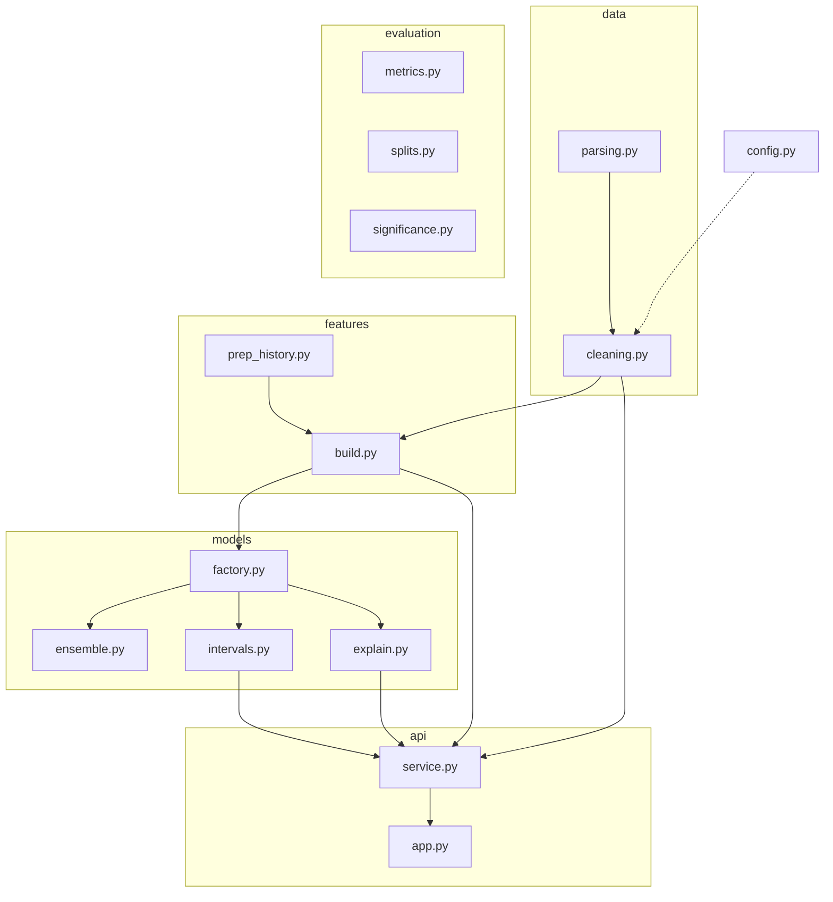

`stats/tests.py` (hypothesis tests) and `sqlfeatures/duck.py` (DuckDB) are used by the
Phase 3 and Phase 4 pipelines only.

## 2. Phase pipeline and artifacts

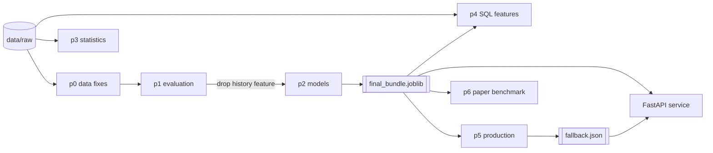

| Phase | Main outputs (`outputs/v2/phaseN/`) |
|---|---|
| 0 | `data_audit.csv`, `model_comparison.csv`, `v1_vs_v2.csv`, `leakage_demo.csv`, `error_by_*.csv` |
| 1 | `random_vs_temporal.csv`, `cv5_*.csv`, `time_cv_*.csv`, `significance.csv`, `ablation.csv`, `final_feature_check.csv` |
| 2 | `xgb_search.csv`, `final_model_comparison.csv`, `interval_*.csv/png`, `late_vs_early_tradeoff.csv`, `shap_*` |
| 3 | `tests_*.csv`, `summary_by_*.csv`, `ols_*.csv`, `vif_*.csv`, three charts |
| 4 | `01–06_*.csv`, `sql_features_*.csv`, `sql_leakage_check.csv` |
| 5 | `service_smoke_test.csv`, `latency.csv`, `ab_test_sample_size.csv`, `drift_psi.csv`, UI screenshot |
| 6 | `paper_benchmark.csv` |

## 3. Data cleaning and repair

`deliveriq/data/cleaning.py` never drops an order and never uses the target. Every repair is
counted in an audit.

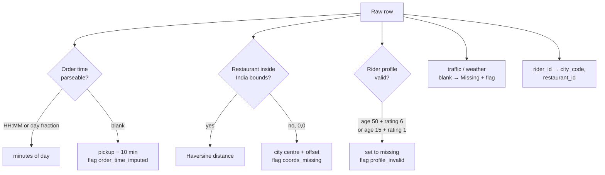

| Repair | Rows |
|---|---|
| Order time in day-fraction format, recovered | 4,068 |
| Order time blank, filled from pickup time | 1,731 |
| Restaurant coordinates invalid, distance recovered | 3,640 |
| Placeholder rider profiles blanked | 91 |
| Rows dropped | 0 |

## 4. Order-time feature construction

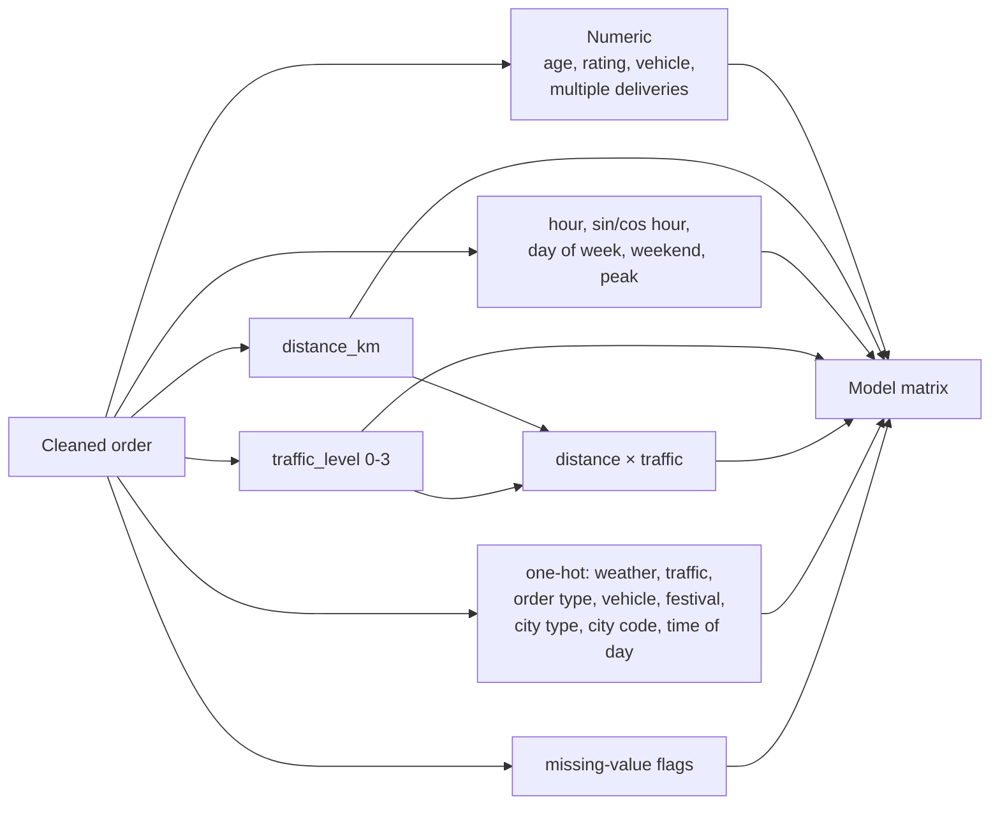

The order's own pickup time and the target are never features (`tests/test_leakage.py`).

## 5. Out-of-fold history encoding

Restaurant prep-time history is built from pickup delays, which are only known after an order is
placed. If a training row's average includes its own value, the model sees information in
training that it will never have at serving time.

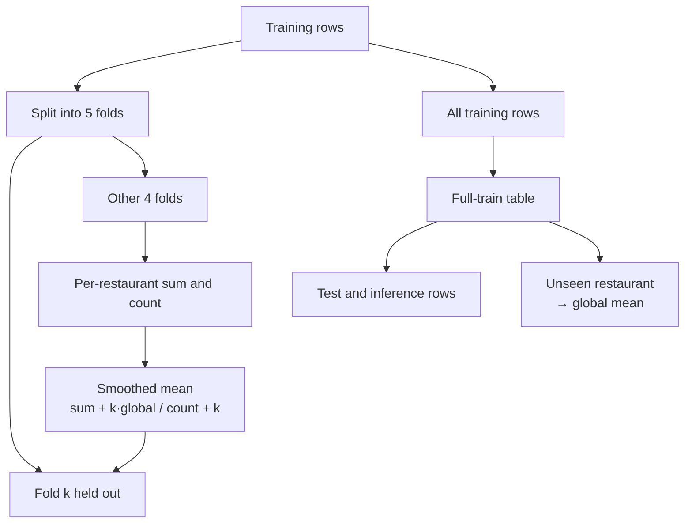

Correlation of the feature with each row's own value: 0.109 with in-sample averaging, 0.001
out-of-fold. The feature was later removed from the final model because it carried no signal
(CV MAE 3.199 → 3.109 without it).

## 6. Evaluation splits and time-series CV

**Chronological split** (Phase 2 onward):

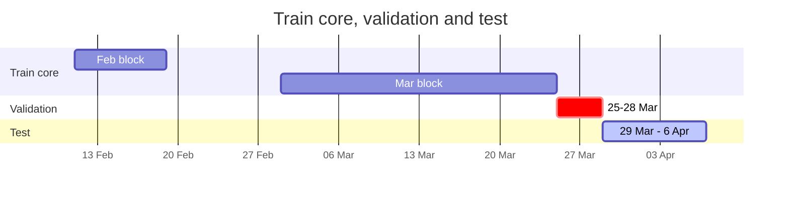

**Rolling-origin CV** (Phase 1 and 4): each fold trains on all earlier days and tests on the
next 4 days with orders.

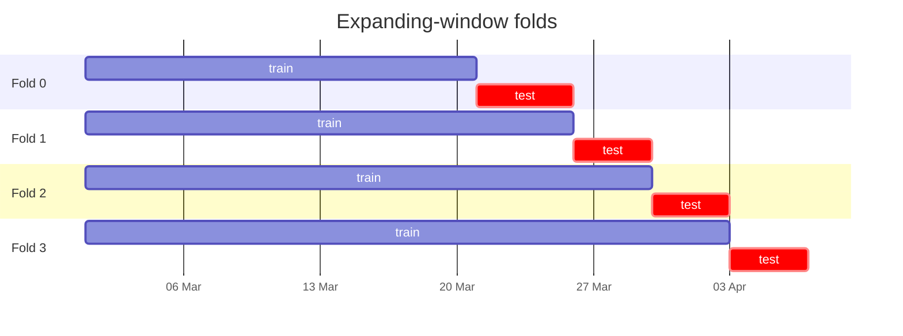

Training in every fold also includes 11–18 Feb. 22 Mar has no orders, so fold 0's four test
days are 21, 23, 24 and 25 Mar.

## 7. Model selection flow

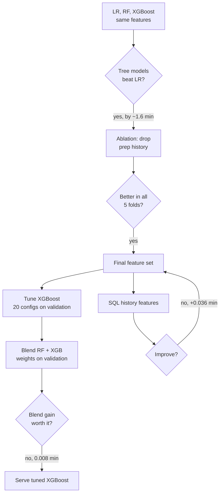

## 8. Conformalized quantile regression

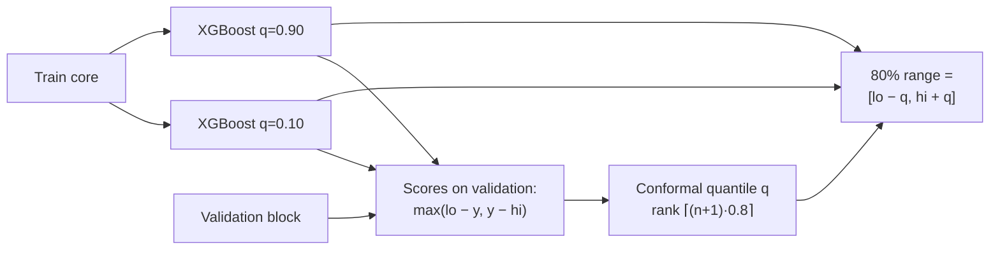

Split conformal (the comparison method) uses a single `|y − ŷ|` quantile, giving every order
the same ±4.9 min width.

## 9. SQL feature lineage

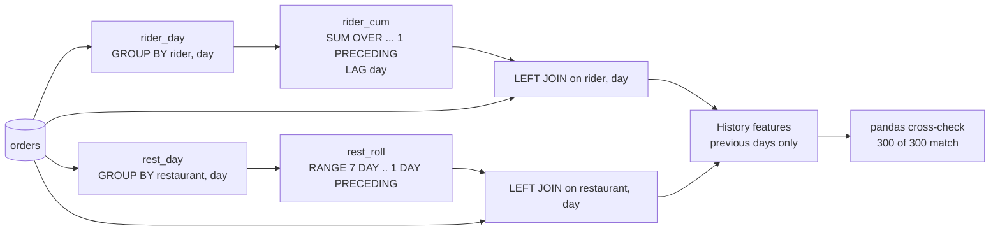

## 10. Prediction service internals

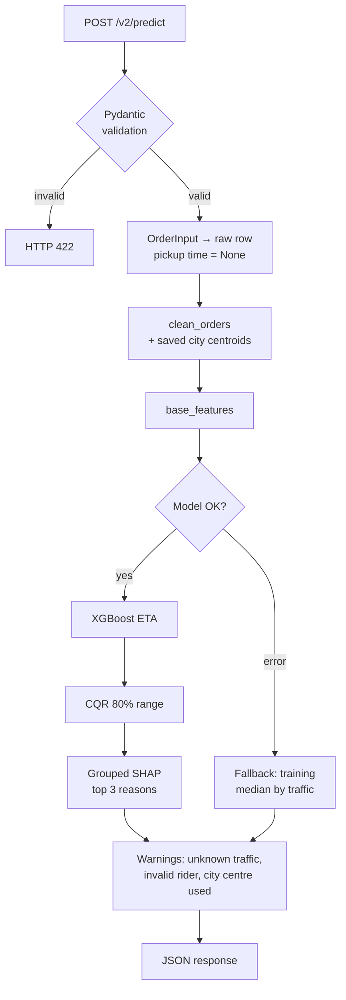

## 11. Model bundle contents

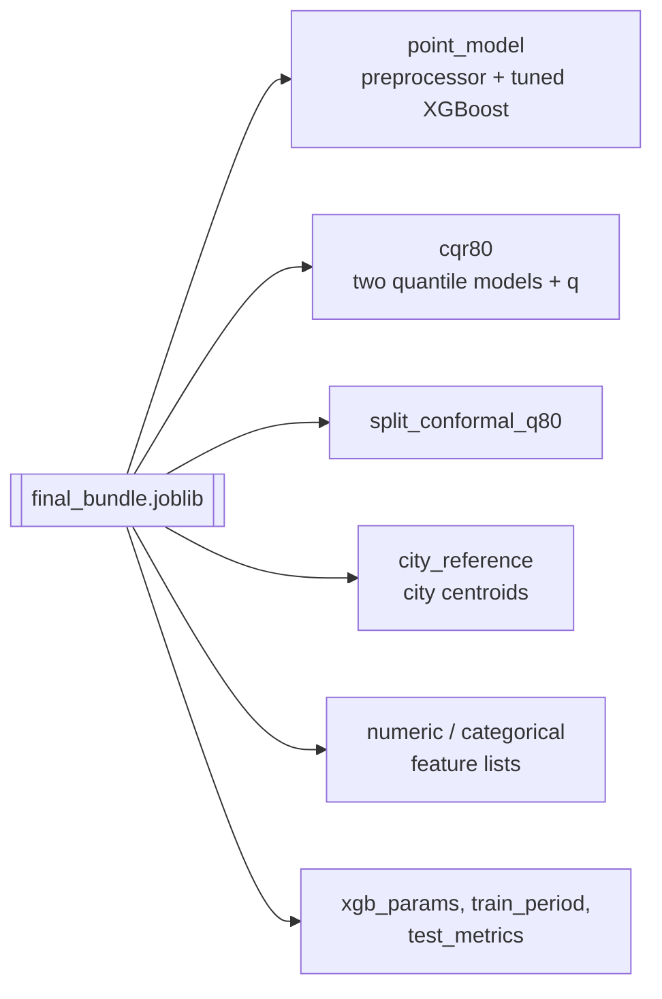

## 12. Test coverage map

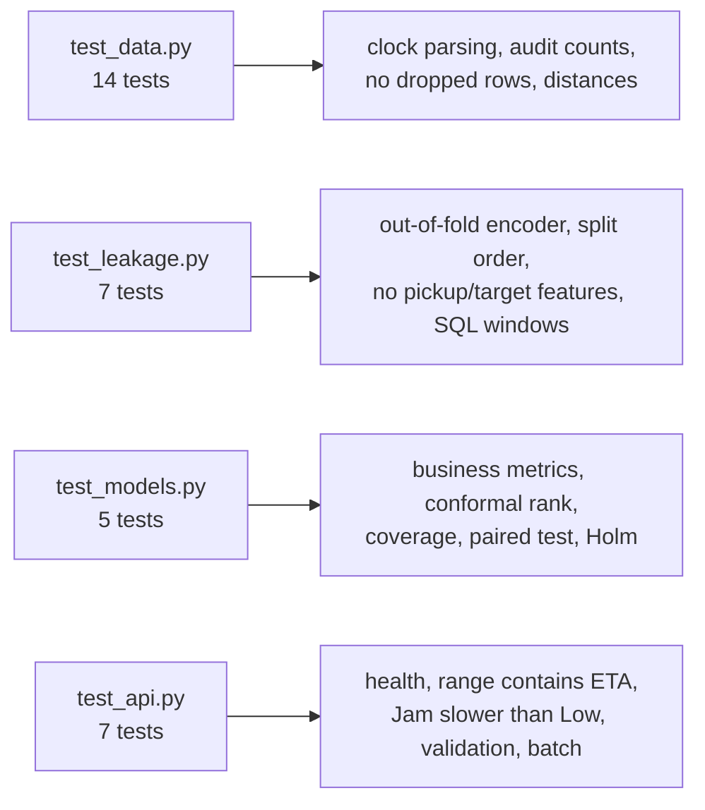

## 13. Production design (design only)

Not implemented; see [PRODUCTION_DESIGN.md](PRODUCTION_DESIGN.md) for details.

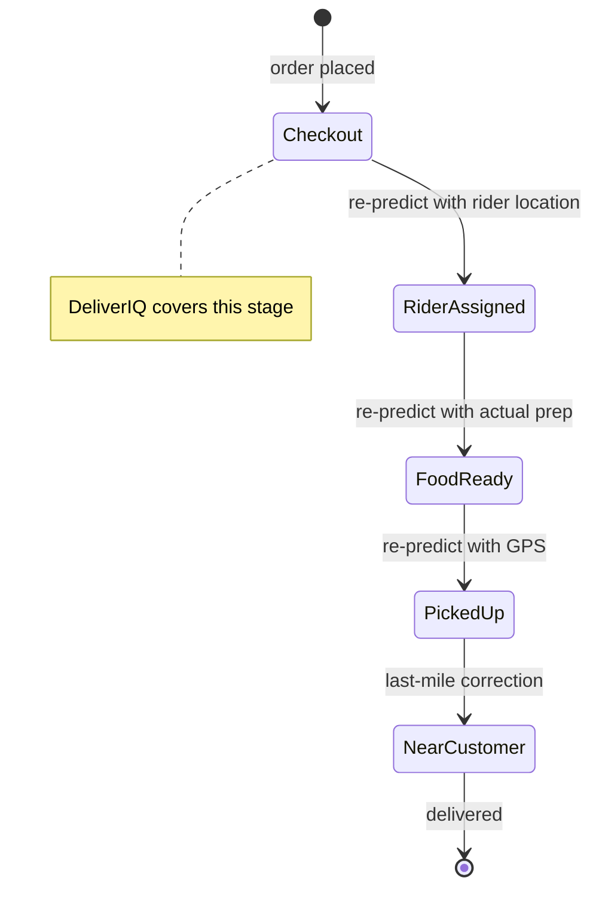
