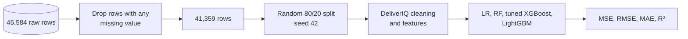

# Benchmark against published work

**Reference.** A. Garg, M. Ayaan, S. Parekh, V. Udandarao. *Food Delivery Time Prediction in
Indian Cities Using Machine Learning Models.* arXiv:2503.15177, March 2025.
[Paper](https://arxiv.org/abs/2503.15177) ·
[Code](https://github.com/Vikranth3140/Food-Delivery-Time-Prediction)

The study uses the same Kaggle food-delivery dataset. After removing rows with missing
values (41,368 records), it compares eight models on a hold-out set; LightGBM is best with
**MSE 20.59 and R² 0.76**.

## Protocol used here

`pipelines/p6_paper_benchmark.py` re-creates the paper's setup as closely as the paper allows:

The same models are also scored on all rows with a random 80/20 split.

## Results

| Protocol | Model | Rows | MSE | RMSE | MAE | R² |
|---|---|---|---|---|---|---|
| Published | LightGBM (paper) | 41,368 | 20.59 | — | — | 0.76 |
| Published | XGBoost (paper) | 41,368 | 25.37 | — | — | 0.71 |
| Published | Random Forest (paper) | 41,368 | 30.03 | — | — | 0.66 |
| Published | Linear Regression (paper) | 41,368 | 49.08 | — | — | 0.44 |
| Paper-style | Linear Regression | 41,359 | 34.77 | 5.90 | 4.71 | 0.604 |
| Paper-style | Random Forest | 41,359 | 14.17 | 3.76 | 3.03 | 0.839 |
| Paper-style | **XGBoost (DeliverIQ tuned)** | 41,359 | **13.71** | 3.70 | 2.98 | **0.844** |
| Paper-style | LightGBM (DeliverIQ features) | 41,359 | 13.66 | 3.70 | 2.98 | 0.844 |
| All rows | XGBoost (DeliverIQ tuned) | 45,584 | 15.41 | 3.93 | 3.12 | 0.825 |
| All rows | LightGBM (DeliverIQ features) | 45,584 | 15.40 | 3.92 | 3.12 | 0.825 |

Published rows are copied from the paper's Table 2; the rest come from
`outputs/v2/phase6/paper_benchmark.csv`.

## What explains the gap

| Area | Paper | DeliverIQ |
|---|---|---|
| Missing data | Rows dropped | Values repaired or flagged; no rows dropped |
| Clock formats | Not discussed | Day-fraction and `24:05` formats recovered (5,799 order times) |
| Invalid coordinates | Not discussed | 3,640 (0, 0) restaurants repaired with city centre + offset |
| Categorical encoding | Label encoding (implies an order for weather, city) | One-hot, with an ordinal code only for traffic |
| Pickup-time features | "Order processing duration" derived from order and pickup times | Same-order pickup time never used (known only after the ETA is shown) |
| Validation | Random hold-out, 5-fold CV | Chronological test, rolling time CV, paired bootstrap on orders and days |
| Output | Point prediction | Point + calibrated 80% range + top-3 reasons |

Every model improves under DeliverIQ's preprocessing, including Linear Regression
(R² 0.60 vs 0.44), and LightGBM ties XGBoost on the same features. The gain therefore comes
mainly from data repair and feature engineering rather than from the boosting library.

## Observations on the dataset that differ from the paper's reading

- The paper describes traffic and weather as real-time signals. In this dataset they are
  static labels, and traffic is fully determined by the order hour
  (`outputs/v2/phase3/hour_x_traffic_crosstab.csv`).
- The paper reports adverse weather (stormy, foggy) as slower than "sunny or clear". The data
  contains no "Clear" category; mean times over all orders are Sunny 21.9, Sandstorms 25.9,
  Stormy 25.9, Windy 26.1, Cloudy 28.9 and Fog 28.9 min.
- Pickup delay takes only the values 5, 10 and 15 min and is unrelated to delivery time
  (η² = 0.0001), so features built from it add noise.

## Caveats

- The paper's split seed and exact cleaning code are not reproduced here, so the comparison is
  at the protocol level, not on identical rows (41,359 vs 41,368 after dropping).
- DeliverIQ's XGBoost settings were tuned on a validation block from this same dataset.
- Only published numbers are quoted for the paper; its code was not re-run.
