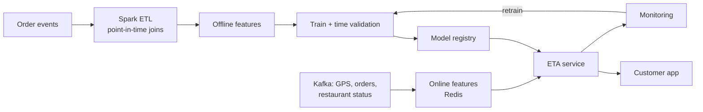

# Methodology

Phase-by-phase record of what was done, why, and what came out. All numbers are taken from
the files in `outputs/v2/`; [RESULTS.md](RESULTS.md) maps each table to its source file.

**Naming.** "v1" is the earlier baseline version of this project (random split, simpler
cleaning); its scores are kept in `data/reference/v1_model_comparison.csv`. "v2" is this
repository.

- [Phase 0 — Data repair](#phase-0--data-repair)
- [Phase 1 — Evaluation](#phase-1--evaluation)
- [Phase 2 — Models, intervals and explanations](#phase-2--models-intervals-and-explanations)
- [Phase 3 — Statistics](#phase-3--statistics)
- [Phase 4 — SQL layer](#phase-4--sql-layer)
- [Phase 5 — Serving and production checks](#phase-5--serving-and-production-checks)
- [Phase 6 — Benchmark against published work](#phase-6--benchmark-against-published-work)

## Phase 0 — Data repair

Phase 0 repaired 13,000+ values without dropping an order; on the same random split as v1, Random Forest improved to 3.14 min MAE (from 3.17) and XGBoost stayed at 3.19.

**Code:** `deliveriq/data/parsing.py`, `deliveriq/data/cleaning.py`, `deliveriq/features/prep_history.py`, `deliveriq/features/build.py`, `deliveriq/evaluation/metrics.py`, `deliveriq/models/factory.py`. **Run:** `python -m pipelines.p0_data_fixes` (about 45 s). **Outputs:** `outputs/v2/phase0/`.

### What the data really looks like

The dataset is semi-synthetic. These patterns were checked directly and drive several decisions below:

- **Pickup delay is always exactly 5, 10 or 15 min** (about one third each) and mean delivery time is 26.3 / 26.4 / 26.3 min for the three values. Restaurant prep time carries no signal here.
- **Drop location = restaurant + (d, d)** with d from a fixed set of 12 values (0.01 to 0.14 degrees); latitude and longitude offsets are always equal.
- **Rider age acts as a step:** ages 20–29 average about 23 min, ages 30–39 about 29.5 min.
- **Rider rating acts in bands:** below 4.0 about 36–38 min, 4.0–4.4 about 34.6 min, 4.5 and above about 24 min.
- **Rider ID encodes city and restaurant:** `DEHRES17DEL01` = city DEH, restaurant 17, rider 01. That gives 22 cities and 440 restaurant IDs, each with a single location.
- **Placeholder rider rows:** 53 rows with age 50 + rating 6, and 38 with age 15 + rating 1.

### Decisions

| Issue | v1 behaviour | v2 decision | Why |
| --- | --- | --- | --- |
| Clock stored as day fraction (4,068) | Hour lost | Parse: fraction × 1440 = minutes | Real data, wrong format |
| Order time blank (1,731) | Hour lost | Pickup time − 10 min (median gap), flag `order_time_imputed` | Gap is 5–15 min, so hour error is at most 5 min; only repairs training history, never used at inference |
| Pickup like `24:05:00` | Row lost from prep average | Hour 24 read as 00 | Valid clock value |
| Restaurant at (0, 0) (3,640) | One fake restaurant, tiny distance | City median location + the row's offset d; flag `restaurant_coords_missing` | All 22 cities have valid rows; offset d is still in the delivery columns |
| Restaurant key | Rounded coordinates | `restaurant_id` from rider ID | One location per ID; not broken by (0, 0) |
| Prep history leakage | Average includes own row | 5-fold out-of-fold average, smoothed (k = 5), global mean for new restaurants | Training feature must look like the inference feature |
| Placeholder riders (91) | Rating 6 clipped to 5 | Age and rating set to missing, flag `rider_profile_invalid` | Values are impossible, not extreme |
| Weather factor | Hand-set (Fog 1.15, Stormy 1.25) | Removed; one-hot weather only | Data disagrees: Sunny 21.9 min fastest, Cloudy and Fog 28.9 slowest |
| Missing traffic / weather | Filled with neutral values | Own "Missing" category plus flag | Missingness is information; hiding it misleads the model |
| Hour | Integer and bucket | Also sin/cos of minute of day | 23:00 and 00:00 become neighbours |
| New features | — | `city_code` (22), `traffic_level` 0–3, distance × traffic level | City is known at order time; traffic has a natural order |

RF and XGBoost hyperparameters are unchanged from v1, so the differences below come from data and features only.

### Results (same random 80/20 split as v1, 9,117 test orders)

| Model | v1 MAE | v2 MAE | v2 RMSE | v2 R² | P90 error | Within ±5 min | Late > 5 min | Train MAE |
| --- | --- | --- | --- | --- | --- | --- | --- | --- |
| Linear Regression | 4.80 | 4.77 | 5.98 | 0.595 | 9.68 | 59.3% | 19.5% | 4.75 |
| Random Forest | 3.17 | **3.14** | 3.95 | 0.823 | 6.29 | 81.0% | 9.4% | 1.93 |
| XGBoost | 3.19 | 3.19 | 4.02 | 0.817 | 6.42 | 80.0% | 11.6% | 2.40 |

**Leakage demo (XGBoost).** The v1-style history feature correlates 0.109 with each row's own pickup delay; the out-of-fold version correlates 0.001. Test MAE barely moves (3.15 leaky vs 3.19 out-of-fold) because prep time has no link to delivery time in this data. The lesson for the interview is the mechanism, not the size: with real data, where prep time matters, this leak would inflate training performance.

**Segment errors (v2 XGBoost, MAE min):**

- Traffic: Low 2.72, Medium 3.09, High 3.59, Jam 3.56, **Missing 4.98** (124 orders).
- Distance: 0–3 km 2.82, 3–6 km 2.93, 6–10 km 3.07, over 10 km 3.44.
- Peak hour 3.44 vs off-peak 2.95.
- Orders with a filled-in order time: 5.06 vs 3.10. All 601 missing-traffic and 616 missing-weather rows sit inside these 1,731 rows, so the raw file loses these fields together.
- Recovered-coordinate orders: 3.10 vs 3.19, so the distance repair works.

## Phase 1 — Evaluation

The scores hold up under a date-based split and cross-validation, and the headline finding is that XGBoost only trailed Random Forest because it overfit the noisy prep-history feature; without it both reach about 3.11 min CV MAE.

**Code:** `deliveriq/evaluation/splits.py`, `deliveriq/evaluation/significance.py`. **Run:** `python -m pipelines.p1_evaluation` (about 8 min; `--final-check-only` runs only section 5). **Outputs:** `outputs/v2/phase1/`.

### 1. Random vs date-based split

Date-based split: train on 36,138 orders before 29 Mar 2022, test on 9,446 orders from the last 9 days (29 Mar – 6 Apr).

| Model | Random MAE | Date-based MAE | Date-based R² | Date-based P90 error | Within ±5 min | Late > 5 min |
| --- | --- | --- | --- | --- | --- | --- |
| Linear Regression | 4.77 | 4.77 | 0.603 | 9.68 | 59.8% | 18.7% |
| Random Forest | 3.14 | 3.19 | 0.826 | 6.37 | 80.5% | 9.6% |
| XGBoost | 3.19 | 3.22 | 0.822 | 6.39 | 79.3% | 9.4% |

The date-based split costs only about 0.03–0.06 min. That is expected here: no drift across 44 days, and the data alternates between two day types that both appear in train and test.

**Data observation.** Average delivery time alternates by day (about 23.3 min, then about 30 min). The slow days have about 3× the distance (15 vs 5 km), twice the share of Jam traffic and later order hours. The model's average error per day is near zero, so the features already explain the pattern and no day-type feature is needed.

### 2. Stability

| Model | 5-fold CV MAE (mean ± sd) | 5-fold R² | Time CV MAE (4 folds × 4 days) | Time CV R² |
| --- | --- | --- | --- | --- |
| Linear Regression | 4.760 ± 0.018 | 0.595 | — | — |
| Random Forest | 3.124 ± 0.019 | 0.825 | 3.143 ± 0.030 | 0.824 |
| XGBoost (with history) | 3.199 ± 0.067 | 0.817 | 3.190 ± 0.053 | 0.818 |

Time CV = expanding window: each fold trains on all earlier days and tests on the next 4 days (even length keeps fast/slow days balanced). XGBoost's larger spread was the first hint that something was unstable.

### 3. Is Random Forest really better than XGBoost?

Paired tests on the same test orders, 2,000 bootstrap resamples:

| Split | Comparison | MAE difference | 95% CI (orders) | 95% CI (whole days) | p (bootstrap) | p (Wilcoxon) |
| --- | --- | --- | --- | --- | --- | --- |
| Random | RF − XGB | −0.048 | \[−0.077, −0.020\] | \[−0.072, −0.025\] | 0.001 | 0.0001 |
| Date-based | RF − XGB | −0.031 | \[−0.059, −0.003\] | \[−0.061, 0.000\] | 0.032 | 0.004 |
| Random | XGB − LR | −1.58 | \[−1.65, −1.51\] | \[−1.65, −1.50\] | < 0.001 | < 0.001 |

RF's edge is statistically real but tiny (about 3 seconds per order), and when whole days are resampled the date-based interval touches zero. Resampling by day matters because orders on the same day share conditions, so they are not independent. Tree models beating Linear Regression by about 1.6 min is unambiguous.

### 4. Which features matter? (XGBoost ablation, 5-fold CV)

| Removed | CV MAE | Change vs full |
| --- | --- | --- |
| Nothing (full) | 3.199 | — |
| Rider age + rating | 4.502 | **+1.30** |
| Distance (+ distance × traffic) | 3.876 | **+0.68** |
| Missing-value flags | 3.208 | +0.01 |
| Cyclic hour | 3.202 | +0.00 |
| City code | 3.190 | −0.01 |
| Distance × traffic | 3.177 | −0.02 |
| Restaurant prep history | 3.109 | **−0.09** |

### 5. Decision: drop restaurant prep history from the final model

| Fold | XGB full | XGB no history | RF full | RF no history |
| --- | --- | --- | --- | --- |
| 0 | 3.318 | 3.148 | 3.139 | 3.130 |
| 1 | 3.188 | 3.126 | 3.127 | 3.107 |
| 2 | 3.173 | 3.083 | 3.105 | 3.087 |
| 3 | 3.153 | 3.084 | 3.104 | 3.107 |
| 4 | 3.165 | 3.105 | 3.145 | 3.131 |
| **Mean** | 3.199 | **3.109** | 3.124 | 3.113 |

Removing the feature improves XGBoost in all 5 folds. The feature is noise here (Phase 0), and XGBoost's deep trees split on it and overfit. The leak-free encoder stays in the code as the method we would use on real data. City code and distance × traffic change MAE by under 0.01, which is within noise, so they stay for interpretability.

## Phase 2 — Models, intervals and explanations

The final model is a tuned XGBoost: 3.13 min MAE and R² 0.832 on the last 9 days, with 80% ETA ranges that actually cover 80.5% of orders.

**Code:** `deliveriq/models/ensemble.py`, `deliveriq/models/intervals.py`, `deliveriq/models/explain.py`, `deliveriq/viz.py`. **Run:** `python -m pipelines.p2_models` (about 3 min). **Outputs:** `outputs/v2/phase2/` and `models/v2/final_bundle.joblib` (5.4 MB).

**Protocol.** Everything is date-based and nothing is chosen on test data. Train core: 31,895 orders (before 25 Mar). Validation: 4,243 orders (25–28 Mar), used for tuning, blend weights and interval calibration. Test: 9,446 orders (29 Mar – 6 Apr). Final point models are refit on core + validation (36,138 orders).

### 1. Tuning

20 random XGBoost configurations, including three loss functions (squared, absolute, pseudo-Huber). Best on validation: 500 trees, learning rate 0.03, depth 8, min child weight 3, subsample 0.8, column sample 0.8, squared error. Validation MAE went from 3.105 (v1 settings) to 3.086. Squared error beat absolute error even though MAE is the metric, because the errors are fairly symmetric.

### 2. Final comparison on the test days

| Model | MAE | RMSE | R² | P90 error | Within ±5 min | Late > 5 min | Early > 5 min |
| --- | --- | --- | --- | --- | --- | --- | --- |
| Linear Regression | 4.755 | 5.975 | 0.603 | 9.67 | 59.9% | 19.5% | 20.6% |
| Random Forest | 3.186 | 3.966 | 0.825 | 6.36 | 80.3% | 9.9% | 9.8% |
| XGBoost (v1 settings) | 3.154 | 3.932 | 0.828 | 6.27 | 80.7% | 10.1% | 9.3% |
| **XGBoost (tuned) — final** | **3.128** | **3.891** | **0.832** | **6.22** | **81.3%** | **9.8%** | **8.9%** |
| Weighted blend (20% RF) | 3.120 | 3.877 | 0.833 | 6.17 | 81.5% | 9.6% | 8.9% |
| Stacked blend | 3.119 | 3.874 | 0.833 | 6.18 | 81.4% | 9.9% | 8.7% |

| Paired test | MAE difference | 95% CI (orders) | 95% CI (days) |
| --- | --- | --- | --- |
| Tuned XGB − RF | −0.058 | \[−0.081, −0.037\] | \[−0.074, −0.041\] |
| Tuned XGB − XGB v1 settings | −0.027 | \[−0.037, −0.015\] | \[−0.036, −0.016\] |
| Blend − tuned XGB | −0.008 | \[−0.012, −0.003\] | \[−0.012, −0.004\] |

**Decision: serve tuned XGBoost alone.** The blend is statistically better but only by 0.008 min (half a second per order). It would add a 250-tree Random Forest to every request, double latency and memory, and make SHAP explanations harder. In an interview: "significant is not the same as worth it."

### 3. ETA ranges (prediction intervals)

| Method | Target | Actual coverage | Mean width | Above upper | Below lower |
| --- | --- | --- | --- | --- | --- |
| Split conformal | 80% | 79.7% | 9.7 min | 10.7% | 9.7% |
| CQR (XGBoost quantiles) | 80% | 80.5% | 10.3 min | 10.4% | 9.1% |
| Split conformal | 90% | 89.9% | 12.4 min | 5.7% | 4.4% |
| CQR (XGBoost quantiles) | 90% | 90.2% | 12.8 min | 5.4% | 4.5% |

Both hit their targets overall, but split conformal uses the same ±4.9 min for every order. Broken down by traffic (80% target), it over-covers easy orders and under-covers hard ones:

| Traffic | Orders | Split conformal coverage | CQR coverage | CQR width |
| --- | --- | --- | --- | --- |
| Low | 3,159 | 87.8% | 81.6% | 8.9 min |
| Medium | 2,314 | 79.7% | 81.4% | 10.5 min |
| High | 870 | 76.7% | 77.8% | 10.9 min |
| Jam | 2,976 | 73.2% | 79.5% | 11.1 min |
| Missing | 127 | **47.2%** | **80.3%** | 18.1 min |

**Decision: serve CQR 80% ranges.** Width adapts to difficulty: when traffic is unknown the range widens to 18 min instead of silently being wrong half the time. Chart: `interval_by_traffic.png`.

### 4. Late vs early trade-off

| Served prediction | MAE | Late > 5 min | Early > 5 min | Mean bias |
| --- | --- | --- | --- | --- |
| Median (q = 0.5) | 3.15 | 10.7% | 8.2% | +0.11 |
| q = 0.6 | 3.24 | **6.1%** | 14.8% | −0.93 |
| q = 0.7 | 3.54 | 3.3% | 23.1% | −2.00 |
| q = 0.8 | 4.09 | 1.4% | 33.0% | −3.19 |
| Tuned XGB + 1 min | 3.26 | 6.1% | 15.1% | −1.03 |
| Tuned XGB + 2 min | 3.57 | 3.9% | 23.7% | −2.03 |

Predicting the 60th percentile cuts "late by more than 5 min" from 10.7% to 6.1% for +0.09 min MAE. That is a product decision, not a modelling one: it depends on how much a late order costs (complaints, refunds, churn) versus an early one (rider waiting, customer not ready). It should be settled with an A/B test (Phase 5). The model serves the mean, and the upper end of the range is the "latest" promise.

### 5. SHAP on the final model

Mean |SHAP| over 2,000 test orders, one-hot columns summed back to their feature:

| Factor | Mean impact (min) |
| --- | --- |
| Rider age | 2.52 |
| Rider rating | 2.17 |
| Distance × traffic | 1.98 |
| Vehicle condition | 1.96 |
| Weather | 1.72 |
| Distance | 1.52 |
| Traffic | 1.19 |
| Multiple deliveries | 0.67 |
| Order time | 0.40 |
| City type | 0.37 |

Local example (worst late order `0x443`): actual 54 min, predicted 34.0. Base value 26.2, plus distance +2.9, traffic +2.4, rider age +2.2, order time +1.4, weather +1.0, rating −1.3. The model pushed the ETA up for the right reasons but could not see what caused the extra 20 minutes. Charts: `shap_global_grouped.png`, `shap_beeswarm.png`.

## Phase 3 — Statistics

Traffic (+9.9 min Jam vs Low), distance (+8.5 min for over 10 km) and festivals (+19.6 min) have large, real effects; prep time has none. The peak-hour effect cannot be separated from traffic, because traffic in this data is set by the clock hour.

**Code:** `deliveriq/stats/tests.py`. **Run:** `python -m pipelines.p3_statistics` (about 10 s). **Outputs:** `outputs/v2/phase3/` (tables plus `target_distribution.png`, `time_by_traffic_weather.png`, `age_rating_steps.png`).

**Method rules.**

- Analysis uses only the 36,138 training orders; looking at test days while forming hypotheses is data snooping.
- Every p-value comes with an effect size, because with 36,000 orders almost everything is "significant".
- 20 p-values are Holm-corrected together.
- Welch tests are used because group variances differ.
- Rank tests (Mann-Whitney, Kruskal-Wallis) are reported alongside, because delivery time is not normal: skew 0.48, D'Agostino p < 0.001.

### The five EDA questions

| Question | Test | Result | Effect size | Verdict |
| --- | --- | --- | --- | --- |
| Q1. Does distance increase time? | Spearman; Welch (over 10 km vs 0–3 km) | ρ = 0.32; +8.48 min \[8.20, 8.75\] | Hedges g = 0.91; η² = 0.13 | Yes, large |
| Q2. Does traffic increase time? | Kruskal-Wallis; Welch (Jam vs Low) | Low 21.2, Medium 26.7, High 27.3, Jam 31.1 min; +9.87 \[9.64, 10.10\] | g = 1.18; η² = 0.19 | Yes, largest single factor |
| Q3. Does prep time dominate? | Kruskal-Wallis over 5 / 10 / 15 min | 26.3 / 26.4 / 26.3 min; p = 0.22 (Holm 0.44) | η² = 0.0001; ρ = −0.009 | No effect at all |
| Q4. Does peak hour matter? | Welch, then stratified by traffic | Raw +4.96 \[4.78, 5.15\]; within Low +1.61 \[1.34, 1.90\]; within High +0.28 (p = 0.33); within Medium +0.73 (p = 0.14); within Jam not estimable | Raw g = 0.55; within Low g = 0.24 | Mostly confounded with traffic |
| Q5. What relates most strongly? | Mutual information (captures steps) | Rating 0.160, hour 0.135, traffic 0.120, multiple deliveries 0.111, distance 0.097, age 0.079 | — | Rider profile and time of day lead |

**Other factors.**

- Festival: +19.6 min \[19.3, 19.9\], g = 2.2, only 701 training orders.
- Multiple deliveries: η² = 0.19.
- Vehicle condition: η² = 0.08.
- Weather: η² = 0.06; Sunny 21.9 min is fastest, Cloudy and Fog 28.8 min slowest.
- City type: η² = 0.06.
- Order type: no effect (p = 0.31).

### Confounding: traffic is a function of the hour

| Hours | Traffic label in the data |
| --- | --- |
| 08–10, 22–00 | Low |
| 11–14 | High |
| 15–19 | Medium |
| 19–22 | Jam |

Peak hour vs traffic: Cramér's V = 0.77. Every Jam order is at peak, so "peak vs off-peak within Jam" cannot be computed. In the regression the peak coefficient **flips sign** (−1.4 min) once traffic is controlled: the raw +5 min is almost entirely traffic. Real traffic would come from a maps API and vary independently of the clock; here it is a label derived from time. This is a good interview example of confounding and Simpson-style reversal.

### Why rider age and rating dominate

| Check | Result |
| --- | --- |
| Age 30 vs age 29 | +6.34 min \[5.79, 6.95\], g = 0.73 |
| Slope inside ages 20–29 | +0.001 ± 0.045 min per year (flat) |
| Slope inside ages 30–39 | +0.008 ± 0.046 min per year (flat) |
| Rating 4.0–4.4 vs 4.5 and above | +10.26 min \[10.04, 10.48\], g = 1.21 |
| Slope inside rating 4.5–4.9 | −0.11 ± 0.81 per point (flat) |
| Age vs distance | ρ = 0.000 (independent) |

A real effect of rider experience would be gradual and correlated with other things. A flat line, a 6-minute cliff at exactly 30, then flat again is a data-generator rule. So the model's reliance on age and rating is correct for this dataset, and it is **not** evidence that older riders are slower. Chart: `age_rating_steps.png`.

### Linear regression and its assumptions

| Specification | R² | AIC | Residual MAE | Breusch-Pagan p |
| --- | --- | --- | --- | --- |
| Age and rating as straight lines | 0.531 | 221,422 | 5.09 | < 0.001 |
| Age and rating as steps (age ≥ 30, rating ≥ 4.5) | **0.571** | **218,403** | 4.85 | < 0.001 |

Step specification, robust (HC3) standard errors:

- Distance: +0.345 min per km.
- Traffic: +2.56 per level.
- Age ≥ 30: +4.86.
- Rating ≥ 4.5: −6.78.
- Multiple deliveries: +3.19 each.
- Vehicle condition: −2.09 per point.
- Festival: +10.41.
- Peak hour: −1.41.

All p < 0.001.

What this shows:

- **Encoding matters for linear models.** Coding the true step shape adds 4 points of R²; trees find the steps on their own, which is one reason they win by 1.6 min.
- **Heteroscedasticity:** Breusch-Pagan rejects constant variance, so plain OLS standard errors are wrong; HC3 fixes the inference (not the fit).
- **Multicollinearity:** VIF for distance 2.0, traffic 4.5, distance × traffic 6.3. That is moderate: it inflates linear-model coefficient uncertainty but does not hurt tree models.

### Data quality summary

Restaurant coordinates invalid 8.0%, rider rating missing 4.4%, rider age missing 4.3%, order time filled in 3.8%, city type missing 2.6%, multiple deliveries missing 2.2%, weather and traffic missing about 1.3% each. Missing traffic and missing order time are strongly linked (Cramér's V = 0.58): they come from the same broken records.

## Phase 4 — SQL layer

Six SQL files now cover KPIs, profiles, rankings, trends and leak-free history features. The history features were verified against pandas (300 of 300 orders match) but did not improve the model, so the final model does not use them.

**Code:** `sql/01–06_*.sql`, `deliveriq/sqlfeatures/duck.py` (DuckDB, in-process, no server). **Run:** `python -m pipelines.p4_sql_features` (about 1 min). **Outputs:** `outputs/v2/phase4/`.

### What each SQL file shows

| File | Business question | SQL concepts |
| --- | --- | --- |
| `01_city_kpis.sql` | Orders, average, P50/P90 time, Jam share and share over 40 min per city | GROUP BY, CASE WHEN inside SUM, QUANTILE\_CONT, COUNT DISTINCT, HAVING |
| `02_hour_traffic_profile.sql` | Average time and traffic mix by hour | FILTER clause pivot, FLOOR, CAST |
| `03_rider_history_features.sql` | Rider's past orders, average time, share of slow orders, days since last active | CTEs, window frame ending at 1 PRECEDING, LAG, LEFT JOIN, COALESCE, NULLIF |
| `04_restaurant_history_features.sql` | Restaurant's orders and average time over the previous 7 days | RANGE frame with INTERVAL, date gaps |
| `05_rider_leaderboard.sql` | Top 3 fastest riders per city | RANK, DENSE\_RANK, NTILE, QUALIFY |
| `06_daily_trend.sql` | Day-over-day change and 7-day moving average | LAG, moving-average frame, percentage change |

**Findings from the analytical queries.**

- All 22 cities have 60 riders and 20 restaurants each.
- City averages sit in a narrow 25.5–27.0 min band.
- The hour profile is where the traffic-equals-hour rule first showed up.
- The daily trend makes the alternating 23 / 30 min days obvious (day-over-day change of about ±6.7 min).

### Leakage rule for SQL features

An order may only use deliveries from **earlier calendar days**. Same-day deliveries may still be in progress when the order is placed, so they are excluded. This is conservative: production could use completed orders up to the minute, but that needs completion timestamps the data does not have. A pandas re-computation for 300 random orders matched the SQL exactly; the pipeline asserts this.

### Do the features help the tuned XGBoost?

| Variant | Test MAE (last 9 days) | Paired difference vs base | 95% CI (days) | Time CV MAE (4 folds) |
| --- | --- | --- | --- | --- |
| Base (final features) | **3.128** | — | — | **3.084** |
| + rider history | 3.163 | +0.036 (worse) | \[+0.019, +0.050\] | 3.102 |
| + restaurant history | 3.131 | +0.004 | \[−0.007, +0.014\] | 3.096 |
| + all SQL features | 3.161 | +0.033 (worse) | \[+0.024, +0.042\] | 3.101 |

Base wins in every time-CV fold. The six SQL columns rank between 55th and 67th of 77 by importance.

**Decision: keep the SQL layer for analytics, leave the history features out of the model.** In this data a rider's speed is fully explained by age, rating and vehicle condition, which the model already has. A noisy average of past times adds variance, not information. On real data, rider and restaurant history are usually among the strongest ETA features, which is why the leak-free pipeline is worth having.

Side note: rider history lowered "late > 5 min" (9.0% vs 9.8%) while raising MAE, a reminder that one metric can hide trade-offs.

## Phase 5 — Serving and production checks

The v2 API returns an ETA, an 80% range, the top 3 reasons and warnings in 65 ms. It runs through the same cleaning code as training, falls back to a rule table if the model fails, and passes 33 automated tests on pandas 2.2 and 3.0.

**Code:** `deliveriq/api/service.py`, `deliveriq/api/app.py`, `frontend/v2/index.html`, `tests/`, `Dockerfile`, `requirements-v2.txt`, [PRODUCTION_DESIGN.md](PRODUCTION_DESIGN.md). **Run:** `python -m pipelines.p5_production` (about 30 s); `uvicorn deliveriq.api.app:app --port 8002`; `python -m pytest tests`. **Outputs:** `outputs/v2/phase5/`, `models/v2/fallback.json`.

### API (port 8002)

| Endpoint | Returns |
| --- | --- |
| `GET /health` | status and model version |
| `GET /model-info` | parameters, training period, test metrics, feature list |
| `POST /v2/predict` | `eta_minutes`, `eta_range_80`, `top_reasons`, `baseline_minutes`, `warnings`, `source`, `latency_ms` |
| `POST /v2/predict/batch` | same, for 1–500 orders |

Design choices:

- **Input validation.** Traffic and weather must be known values or null; date is DD-MM-YYYY; rating 1–5. Bad input returns HTTP 422.
- **Unknown fields are allowed.** The response widens the range and says why, for example "traffic unknown: range widened".
- **(0, 0) restaurant coordinates** fall back to the city centre saved with the model.
- **No train/serve skew.** Pickup time is never sent, and requests go through `clean_orders` and `base_features`.
- **Fallback.** If prediction throws, the service answers with the training median for that traffic level (Low 20, Medium 26, High 27, Jam 31 min) and marks `source: fallback`.

### Checks

| Check | Result |
| --- | --- |
| 859 real test orders sent as raw requests | MAE 3.02, 80% range coverage 81.3%, mean width 10.1 min, range always contains the ETA |
| Latency, single order with SHAP reasons | p50 65 ms, p95 71 ms |
| Latency, single order without reasons | p50 38 ms (XGBoost itself 0.7 ms; pandas preprocessing about 3.5 ms) |
| Batch of 100 with reasons | 11 ms per order |
| pytest, 33 tests (parsing, cleaning counts, leakage guards, conformal maths, paired test, Holm, API behaviour) | all pass on pandas 3.0.2 and pandas 2.2.3 |
| Browser check of the web UI | ETA, range bar, reasons and warnings render (`ui_v2_screenshot.png`) |
| Docker image build | not yet verified (Dockerfile provided) |

**Compatibility note.** shap older than 0.51 cannot read XGBoost 3.x models, so `requirements.txt` pins shap ≥ 0.51, scikit-learn 1.8.0 and XGBoost 3.2.0 (a saved model must be loaded with the versions that trained it). With other versions, run `python -m pipelines.run_all` to retrain.

### Drift baseline (PSI, training period vs test days)

Every feature and the target are stable (PSI ≤ 0.02) except **city\_code, PSI 1.10**. The 10 smaller cities appear only in February; the test days contain only the 12 larger cities. It is a real example of what a monitoring job should catch, such as a city launch or exit.

### A/B test sizing (α = 0.05, power 0.8, baseline from test days)

| Metric | Baseline | Detect | Orders per arm |
| --- | --- | --- | --- |
| Late > 5 min rate | 9.8% | 20% relative drop | 3,272 |
| Late > 5 min rate | 9.8% | 10% relative drop | 13,771 |
| Late > 5 min rate | 9.8% | 5% relative drop | 56,406 |
| Absolute ETA error | 3.13 min | −0.10 min | 8,414 |
| Absolute ETA error | 3.13 min | −0.05 min | 33,650 |

The standard deviation of absolute error on the test days is 2.3 min. At platform volume these sizes take hours, so run length is set by weekly cycles (7–14 days) instead.

### Production design (full version in [PRODUCTION_DESIGN.md](PRODUCTION_DESIGN.md))

The ETA service reads the trained model and fresh features and answers the app; monitoring compares predictions with actuals and triggers retraining.

- **ETA is re-predicted at each stage:** checkout (this model), rider assigned, food ready, picked up (GPS), near customer.
- **Randomise the A/B test by customer**, or use city × time-slot switchbacks when riders are shared between arms.
- **Primary metric:** late > 5 min. **Guardrails:** checkout conversion, rider idle time.
- **Monitoring:** PSI drift, MAE and bias by segment, range coverage (alert outside 75–85%), late rate. Weekly retraining plus drift-triggered retraining; shadow mode before any A/B test.

## Phase 6 — Benchmark against published work

A 2025 study (arXiv:2503.15177) on the same dataset reports LightGBM with MSE 20.59 and R² 0.76.
Re-creating its protocol (drop incomplete rows, random 80/20 split), DeliverIQ's tuned XGBoost
reaches MSE 13.71 and R² 0.844, and LightGBM on DeliverIQ features ties it (MSE 13.66). The
improvement comes from data repair and features, not the choice of boosting library.

**Run:** `python -m pipelines.p6_paper_benchmark` (about 1 minute; add LightGBM with
`pip install lightgbm`). **Output:** `outputs/v2/phase6/paper_benchmark.csv`.
Full comparison and caveats: [BENCHMARK.md](BENCHMARK.md).
