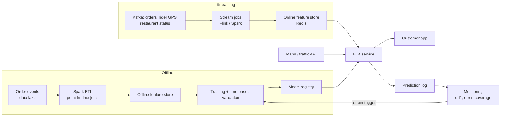

# DeliverIQ — How this would run at food-delivery scale

This document explains how the offline DeliverIQ project would become a production ETA
system at a large food-delivery platform. Everything here is **design, not implemented**, except
where marked *(built)*.

---

## 1. What the system must do

| Requirement | Target | DeliverIQ today |
|---|---|---|
| ETA shown when the customer places the order | p99 latency < 100 ms per request | 38 ms (no reasons), 65 ms (with SHAP reasons), single process *(built, measured)* |
| Show a range, not just a number | 80% of orders inside the range | CQR 80% range, 80.5% coverage on test days *(built)* |
| Explain the ETA (support / ops) | top 3 reasons | grouped SHAP *(built)* |
| Never fail silently | fallback answer if the model is down | median-by-traffic table *(built)* |
| Update as the order progresses | re-predict at each stage | design only (section 2) |
| Scale | tens of thousands of predictions / second at peak | design only (section 5) |

## 2. One order, several ETAs

An ETA is not one prediction. It is re-estimated as information arrives:

| Stage | What is newly known | Model |
|---|---|---|
| T0 — browsing / checkout | restaurant, customer location, time, live traffic, restaurant load | **order-time model (this project)** |
| T1 — rider assigned | rider location, rider's current task, rider history | + distance rider→restaurant |
| T2 — food ready | actual prep time | remaining = wait + travel |
| T3 — picked up | live GPS trace | remaining-travel model (road-network ETA) |
| T4 — near customer | last-mile factors (apartment, gate, parking) | last-mile correction by address |

The customer-facing ETA should change smoothly: large jumps hurt trust more than a
slightly worse average error.

## 3. Architecture

## 4. Features: where each one comes from

| Feature group | Source | Freshness | In this project |
|---|---|---|---|
| Distance, time of day, day of week | request | real time | yes *(built)* |
| Road distance and live travel time | maps API | seconds | no — Haversine used instead |
| Live traffic | maps / GPS aggregates | 1–5 min | label only (it is set by hour in this data) |
| Restaurant prep-time history, current queue length | order stream + batch | minutes / daily | leak-free code *(built)*; no signal in this data |
| Rider history, rider distance to restaurant | batch + GPS | daily / seconds | SQL features *(built)*; no gain in this data |
| Weather | weather API | 15 min | label |
| Festivals, rain alerts, cricket matches | calendar / ops input | daily | festival flag |

**Point-in-time correctness.** Every training row may only use feature values that existed
when that order was placed. The same rule is enforced here by out-of-fold restaurant history
(Phase 0) and "previous days only" SQL windows (Phase 4), both covered by tests.

**Train/serve skew.** The API calls the same cleaning and feature code as training *(built)*.
In production this is what a feature store guarantees.

## 5. Serving

- Stateless ETA service behind a load balancer; model loaded once per worker.
- XGBoost inference is cheap (about 1 ms per order). SHAP reasons cost more, so compute them
  asynchronously or only for support tools, not for every checkout call.
- Batch scoring for listing pages (many restaurants at once) with a short cache
  (restaurant × area × 5-minute bucket).
- Timeouts: if features are late, predict with what is available, and let the range widen.
  The CQR model does this automatically (unknown traffic → 18-minute range instead of 10).
- **Fallback chain:** model → median-by-traffic-and-city table *(built)* → static city median.
- Deploy new models in **shadow mode** first (predict, log, don't show), then A/B test.
- Model latency here *(measured)*: p50 38 ms per single call without SHAP, 65 ms with SHAP,
  11 ms per order in a batch of 100 — all in pure Python with pandas preprocessing. A
  production path would drop pandas from the hot path.

## 6. Monitoring

| Signal | How | Alert when |
|---|---|---|
| Input drift | PSI per feature, daily *(built baseline)* | PSI > 0.2 |
| Data quality | share missing / invalid per field | 2× the training rate |
| Accuracy | MAE, P90 error by city, hour, traffic (actuals arrive ~45 min later) | +10% vs last 7 days |
| Customer promise | share of orders late by > 5 min | above target |
| Range calibration | share of actuals inside the 80% range | outside 75–85% |
| Bias | mean(actual − predicted) by segment | beyond ±1 min |

**Real example from this data.** The PSI check flagged `city_code` (PSI 1.10): the 10 smaller
cities appear only in February and the test period only contains the 12 larger cities.
Every other feature and the target are stable (PSI < 0.02). In production, a city launch
or exit would look exactly like this and should trigger a check of per-city accuracy.

**Retraining.** Weekly scheduled retrain on a rolling window, plus triggered retrains on
drift or accuracy alerts. A new model must beat the current one on the latest weeks
(time-based validation) with a paired test before going to A/B.

## 7. Launching a new model: A/B test design

- **Unit of randomisation.** Customers see ETAs, so randomise by customer. Riders are shared
  between both arms, so if the new ETA changes customer or rider behaviour, the arms interact.
  For changes that affect dispatch, use **city × time-slot switchback** experiments.
- **Primary metric.** Share of orders late by more than 5 min vs the promised ETA.
- **Secondary.** MAE, range coverage, conversion at checkout, cancellations, support contacts
  about delays, ratings.
- **Guardrails.** Conversion must not drop (over-promising late times loses orders);
  rider idle time must not rise.
- **Sample size** *(computed, α = 0.05, power 0.8, from the test-day baseline)*:

| Metric | Baseline | Detect | Orders per arm |
|---|---|---|---|
| Late > 5 min rate | 9.8% | 10% relative drop (→ 8.8%) | 13,771 |
| Late > 5 min rate | 9.8% | 5% relative drop (→ 9.3%) | 56,406 |
| Absolute ETA error | 3.13 min | −0.10 min | 8,414 |
| Absolute ETA error | 3.13 min | −0.05 min | 33,650 |

At large-platform volume this is hours, not weeks, so the real constraint is covering full weekly
cycles (run at least 7–14 days) and avoiding novelty effects.
- **Analysis.** Orders from the same customer are correlated → cluster-robust standard
  errors or a customer-level bootstrap. Pre-register the metric and the stopping rule; no
  peeking without sequential-testing corrections.

## 8. Choosing the served number (late vs early)

Serving a higher quantile reduces late orders but makes more orders early
*(measured on test days)*:

| Served prediction | MAE | Late > 5 min | Early > 5 min |
|---|---|---|---|
| Median | 3.15 | 10.7% | 8.2% |
| 60th percentile | 3.24 | 6.1% | 14.8% |
| 70th percentile | 3.54 | 3.3% | 23.1% |

The right point depends on the business cost of each error (refunds, complaints, lost
orders) and should be chosen with an A/B test, not by the data scientist alone.

## 9. What would change with real data

1. Replace Haversine with road-network distance and live travel time.
2. Model prep time properly (it is random noise in this dataset).
3. Add restaurant load (open orders), rider supply in the area, and rain intensity.
4. Separate prep, wait, and travel into sub-models whose sum is the ETA — easier to debug.
5. Use a longer history (months) and validate on multiple future weeks.
6. Re-check fairness: rider age is the top feature here because the dataset has a rule at
   age 30. With real data, rider attributes must not be used in ways that disadvantage
   riders (e.g. in assignment), and their effect should be audited.

## 10. Known limitations of this project

- Semi-synthetic data: step rules for age and rating, traffic set by hour, prep time random,
  fixed drop-point offsets. Scores are not comparable with real-world ETA systems.
- 44 days of data, two different city sets (February vs March–April).
- No live signals; the "real-time" part is the serving path, not the data.
