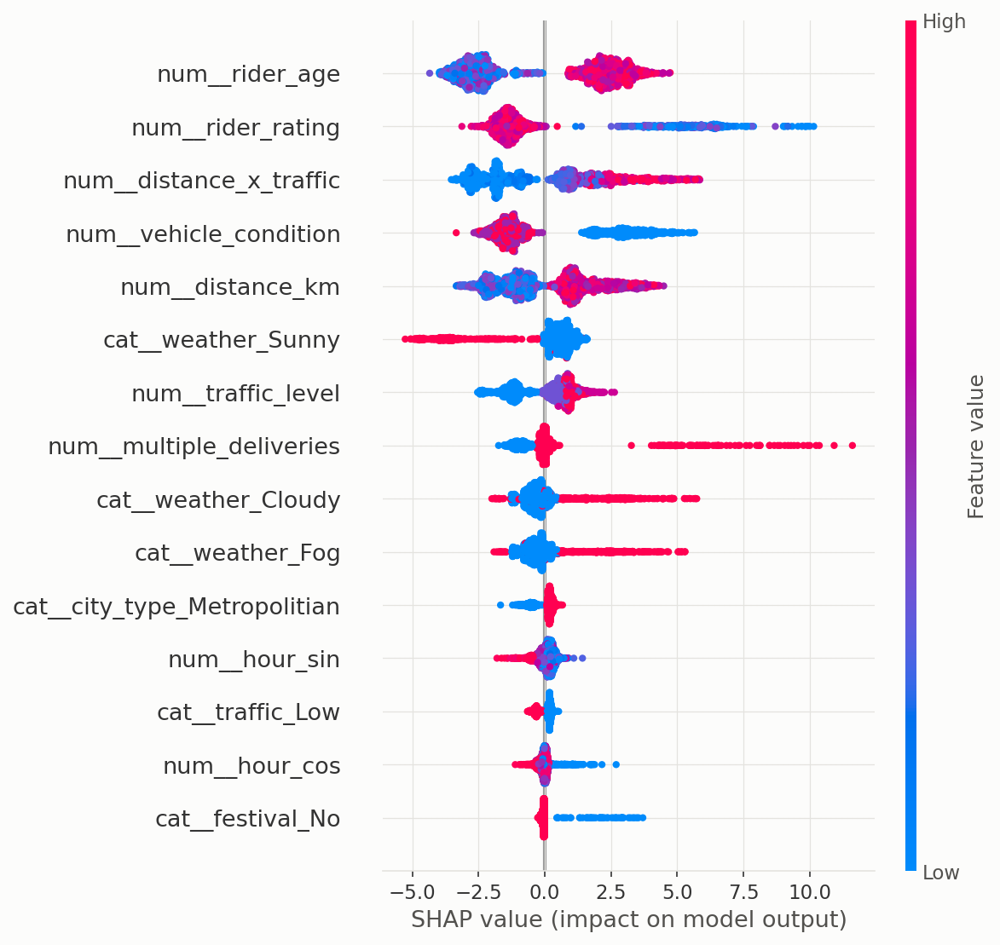
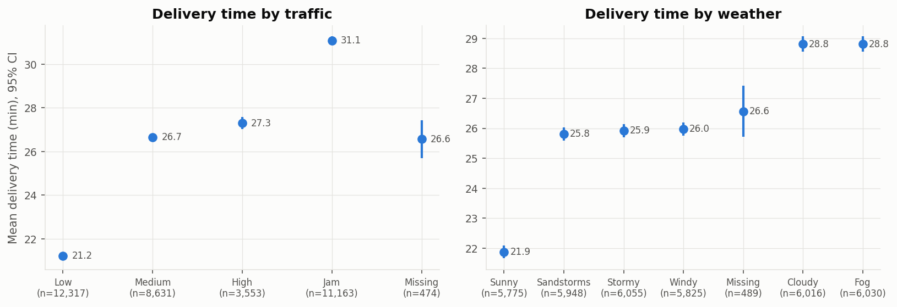
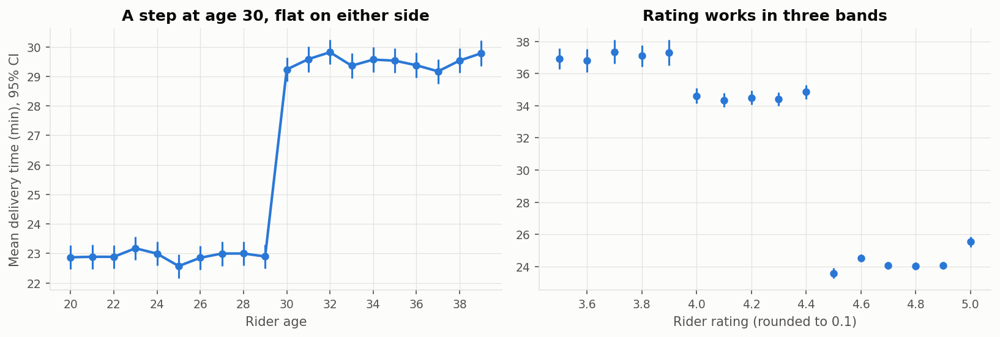
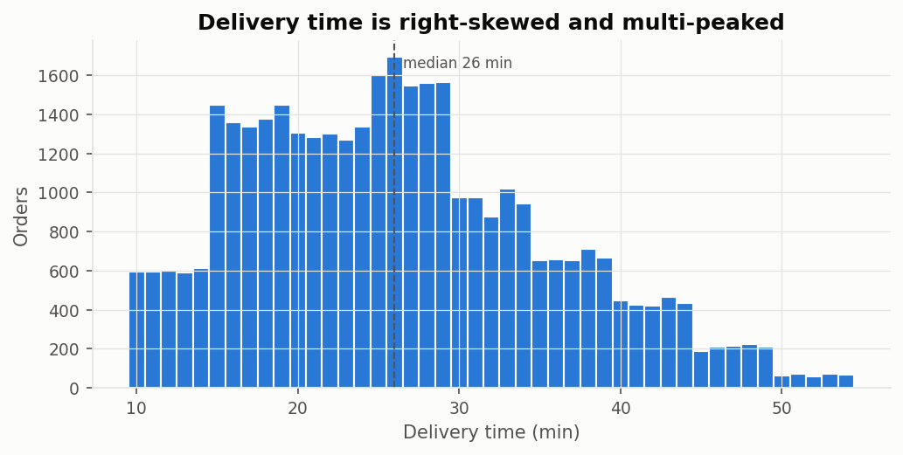

# Results

Every headline number in this repository, with the file it comes from. Re-running
`python -m pipelines.run_all` regenerates all of them (latency depends on the machine).

## Headline (chronological test: 29 Mar – 6 Apr 2022, 9,446 orders)

| Metric | Value | Source |
|---|---|---|
| MAE / RMSE / R² (tuned XGBoost) | 3.128 min / 3.891 min / 0.832 | `outputs/v2/phase2/final_model_comparison.csv` |
| Median / P90 absolute error | 2.75 / 6.22 min | same |
| Within ±5 min / late > 5 min / early > 5 min | 81.3% / 9.8% / 8.9% | same |
| Linear Regression MAE | 4.755 min | same |
| 80% CQR range coverage / mean width | 80.5% / 10.3 min | `outputs/v2/phase2/interval_coverage.csv` |
| API latency (single order with reasons, p50) | ~65 ms | `outputs/v2/phase5/latency.csv` |
| Tests | 33 passed | `python -m pytest tests` |

## Phase 0 — data repair (random 80/20 split, 9,117 test orders)

| Model | Baseline version MAE | This version MAE | RMSE | R² |
|---|---|---|---|---|
| Linear Regression | 4.80 | 4.77 | 5.98 | 0.595 |
| Random Forest | 3.17 | 3.14 | 3.95 | 0.823 |
| XGBoost | 3.19 | 3.19 | 4.02 | 0.817 |

Sources: `phase0/v1_vs_v2.csv`, `phase0/model_comparison.csv`. Repairs: `phase0/data_audit.csv`.
Segment errors: `phase0/error_by_*.csv`.

## Phase 1 — evaluation

| Check | Result | Source |
|---|---|---|
| Random vs chronological MAE (XGBoost) | 3.19 vs 3.22 | `phase1/random_vs_temporal.csv` |
| 5-fold CV MAE: LR / RF / XGB | 4.760 ± 0.018 / 3.124 ± 0.019 / 3.199 ± 0.067 | `phase1/cv5_summary.csv` |
| Rolling time CV MAE: RF / XGB | 3.143 ± 0.030 / 3.190 ± 0.053 | `phase1/time_cv_summary.csv` |
| RF − XGB (random split) | −0.048 min, 95% CI [−0.077, −0.020] | `phase1/significance.csv` |
| Removing rider age + rating | +1.30 min MAE | `phase1/ablation.csv` |
| Removing distance | +0.68 min MAE | same |
| Removing restaurant prep history | −0.09 min MAE (better in 5/5 folds) | `phase1/final_feature_check.csv` |

## Phase 2 — models, intervals, explanations

| Model (test days) | MAE | RMSE | R² |
|---|---|---|---|
| Linear Regression | 4.755 | 5.975 | 0.603 |
| Random Forest | 3.186 | 3.966 | 0.825 |
| XGBoost (baseline settings) | 3.154 | 3.932 | 0.828 |
| **XGBoost (tuned)** | **3.128** | **3.891** | **0.832** |
| Weighted blend (20% RF) | 3.120 | 3.877 | 0.833 |
| Stacked blend | 3.119 | 3.874 | 0.833 |

| Interval method | Target | Coverage | Mean width |
|---|---|---|---|
| Split conformal | 80% | 79.7% | 9.7 min |
| CQR | 80% | 80.5% | 10.3 min |
| Split conformal | 90% | 89.9% | 12.4 min |
| CQR | 90% | 90.2% | 12.8 min |

Sources: `phase2/final_model_comparison.csv`, `phase2/significance.csv`,
`phase2/interval_coverage.csv`, `phase2/interval_coverage_by_segment.csv`,
`phase2/late_vs_early_tradeoff.csv`, `phase2/xgb_search.csv`, `phase2/shap_global_grouped.csv`.

## Phase 3 — statistics (training period only)

| Question | Result | Effect size |
|---|---|---|
| Distance (> 10 km vs 0–3 km) | +8.48 min [8.20, 8.75] | Hedges g 0.91 |
| Traffic (Jam vs Low) | +9.87 min [9.64, 10.10] | g 1.18, η² 0.19 |
| Prep time (5 / 10 / 15 min) | no difference, p = 0.22 | η² 0.0001 |
| Peak vs off-peak | +4.96 min raw; +1.61 within Low traffic | g 0.55 raw |
| Festival | +19.6 min [19.3, 19.9] | g 2.20 |
| Rider age 30 vs 29 | +6.34 min [5.79, 6.95] | g 0.73 |
| OLS R² (linear vs step coding) | 0.531 vs 0.571 | — |

Sources: `phase3/tests_*.csv`, `phase3/age_rating_*.csv`, `phase3/ols_*.csv`,
`phase3/hour_x_traffic_crosstab.csv`.

## Phase 4 — SQL features

| Variant (tuned XGBoost) | Test MAE | Time CV MAE |
|---|---|---|
| Base features | 3.128 | 3.084 |
| + rider history | 3.163 | 3.102 |
| + restaurant history | 3.131 | 3.096 |
| + all SQL features | 3.161 | 3.101 |

SQL features match a pandas re-computation for 300 of 300 sampled orders. Sources:
`phase4/sql_features_*.csv`, `phase4/sql_leakage_check.csv`, `phase4/01–06_*.csv`.

## Phase 5 — serving and production checks

| Check | Result | Source |
|---|---|---|
| 859 test orders sent as API requests | MAE 3.02, 80% coverage 81.3% | `phase5/service_smoke_test.csv` |
| Latency p50: with reasons / without / batch of 100 per order | 65.5 / 38.4 / 11.5 ms | `phase5/latency.csv` |
| Drift (PSI) | all features ≤ 0.02 except city_code 1.10 | `phase5/drift_psi.csv` |
| A/B size for a 10% relative drop in late orders | 13,771 orders per arm | `phase5/ab_test_sample_size.csv` |

## Phase 6 — benchmark

See [BENCHMARK.md](BENCHMARK.md). Source: `phase6/paper_benchmark.csv`.
